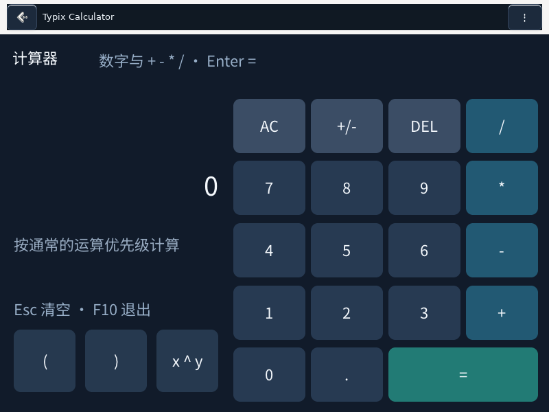
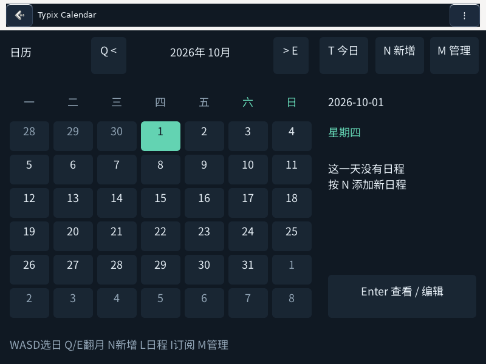
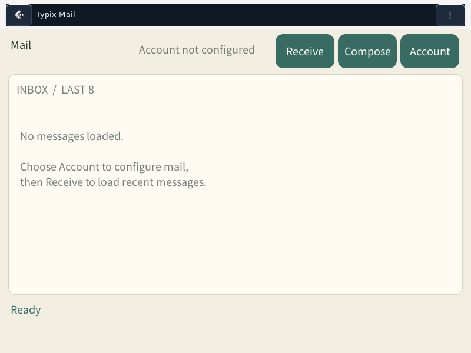

# TypixDeck native application suite

Ports of the complete 18-entry public C1Max catalog for official Raspberry Pi OS ARM64. The existing Typix Launcher, Reader and Gamer fulfill Launcher, CrossPoint and NES without replacing their files or data. This suite provides the other 15 individually installable complete debs. See [inventory and limits](docs/PORT-STATUS.md).

Ten applications preserve their original C++/LVGL application logic in compositor-managed GTK3 windows. Piano, Camera and HIDPilot use native GTK3 implementations. DOS and PS1 have real local-library/session frontends backed by the distribution DOSBox and Mednafen packages. No browser runtime, device snapshots, ROM, BIOS or account configuration is included.

## Bilibili 0.2.1 transport correction

Bilibili 0.2.1 passes its required Referer and User-Agent to MPlayer's HTTPS
transport, fixing the missing-header 403 defect. TLS certificate verification
uses the system CA bundle. Login credentials are still kept away from video
CDNs. Other applications remain at their existing versions. See
[transport checks and limits](docs/BILIBILI-0.2.1.md).

## Responsive UI 0.2.0

The 0.2.0 source adapts application widgets to the available TypixDeck window, removes the common bottom key panel and retains a compact Back/menu header. Terminal resizes its actual PTY grid; image and video previews retain their aspect ratio. Camera is held at its existing 0.1.0 version.

These screenshots show the **actual rebuilt 0.2.0 ARM64 debs**, extracted and launched in an isolated Debian Trixie ARM64 GTK/Xvfb environment at 800×600. Network access was disabled and user state was temporary. All ten native applications started, rendered and exited successfully. This is not physical CM4 touch, audio or external-service acceptance. Additional actual LVGL source renders cover 1024×768 and 1280×800 content viewports. See [checks and limits](docs/RESPONSIVE-UI.md).







## Build

On the target distribution, provide build dependencies `build-essential cmake pkg-config libgtk-3-dev dpkg-dev python3` through the normal audited system administration path. Building does not install packages.

```sh
cmake -S . -B build -DCMAKE_BUILD_TYPE=Release
cmake --build build -j2
python3 tools/build_debs.py --repository OWNER/REPOSITORY
```

The build defaults to 0.2.0-1 for the 14 selected applications and excludes Camera. Rebuilding Camera requires explicit `--apps camera --version 0.1.0-1`; its source and existing package are unchanged. The published native 0.2.0 packages were built with the isolated Trixie ARM64 recipe below; physical Pi OS runtime validation is still required for touch, sound and external services.

```sh
docker build --platform linux/arm64 -f tools/Dockerfile.trixie-arm64 -t typix-c1max-builder:trixie-arm64 .
docker run --rm --platform linux/arm64 --network none -v "$PWD:/work" typix-c1max-builder:trixie-arm64 sh -c \
  'cmake -S . -B build -DCMAKE_BUILD_TYPE=Release && cmake --build build -j6 && python3 tools/build_debs.py --repository typixdeck/c1max-suite --apps calculator calendar gomoku terminal processing airtune streamplayer bilibili mail moonpilot'
```

Use a fresh native `build` directory when changing between host operating systems. The container installs its build dependencies inside the image only; it does not install or change a Raspberry Pi. See [ARM64 build and isolated GUI evidence](docs/RESPONSIVE-UI.md#arm64-package-validation).

The architecture-independent Python apps can also be assembled on a development computer with an explicit deployment target, without changing or pretending to detect the host OS:

```sh
python3 tools/build_debs.py --repository typixdeck/c1max-suite --python-only --target-os raspios-trixie --apps piano dosbox ps1
```

This opt-in path rejects native apps and Camera. It packages the actual scripts and declared dependencies; it does not prove target-device GUI/audio/game runtime behavior. The 10 native ARM64 applications still require the normal Linux build above.

The repository argument is an explicit source-publication input. The script creates `packages/<app>/app.json` and its complete `dist/*.deb`. It does not create that repository, sign, upload, install or publish. Native dependencies are derived using `dpkg-shlibdeps`; distro compatibility matches the build host. A Trixie binary is not advertised as Bookworm-compatible.

Native applications install real ARM64 ELF commands at `/usr/bin/typix-<app>` with matching desktop files, resources and licenses. Python apps install their full implementation. Each package has its own resource prefix and declares system runtimes in Depends. There are no package maintainer scripts and no shared files that conflict between packages.

## Desktop controls and data

F10 exits native LVGL apps, F11 toggles fullscreen, Escape goes back/cancels, F2 is the original symbol-prefix key. Alt+Tab stays with the desktop. The compact header supplies Back/cancel and a menu with Close and keyboard help. Its optional native GTK text field supports input/paste into the selected application field, including the existing IME path; application-specific character limits still apply. There is no persistent common key panel or software keyboard. The content follows the available window aspect and reflows widget geometry; fonts retain their proportions. Physical keyboard navigation remains available. Piano, HID and game-library frontends keep their actual application controls.

Application data stays under `$XDG_DATA_HOME/typix-c1max/<app>` (default `~/.local/share/typix-c1max`) for C++ ports. DOS/PS1 use their own `typix-<app>` XDG directory. Camera uses `$XDG_DATA_HOME/c1max-camera`; Piano/HID keep no persistent data. No existing Reader, Gamer, Launcher or Copilot data is touched. Package upgrade/remove does not remove user data. No privileged GUI or system/USB/MUX/display configuration is performed.

HID requires already-configured writable keyboard/mouse gadget nodes and correct report layouts; camera requires an actually compatible V4L2 device; PS1 requires legal game/BIOS files. Media, mail, Sunshine and AI features require user-configured services. See per-app source documentation for inherited protocol and format limits. Real physical hardware/service acceptance must be reported separately from isolated startup/logic checks.

## Source and licenses

`upstream/` was originally imported from the public tracked C1Max application set and is now the maintained application-port source. Read-only reference snapshots elsewhere are not changed. The dependency commits/checksums are preserved in `upstream/dependencies.json` and `upstream/archives.json`. No ignored local app, configuration, private server, data, cache or compiled binary was imported. `port/` replaces hardware-specific display/input and desktop integrations. Original third-party GPL, MIT, Apache, zlib and OFL notices accompany the source and every generated deb. GPL-linked Bilibili/MoonPilot binaries require this corresponding source and build recipes to be made available with publication. No public-repository publication is performed by these tools.

## Applications

| Application | Source / package descriptor | UI evidence |
| --- | --- | --- |
| 计算器 / Calculator | [packages/calculator](packages/calculator/app.json) | [0.2 ARM64 GTK](docs/screenshots/calculator-0-2-0-arm64.png) |
| 日历 / Calendar | [packages/calendar](packages/calendar/app.json) | [0.2 ARM64 GTK](docs/screenshots/calendar-0-2-0-arm64.png) |
| 五子棋 / Gomoku | [packages/gomoku](packages/gomoku/app.json) | [0.2 ARM64 GTK](docs/screenshots/gomoku-0-2-0-arm64.png) |
| 终端 / Terminal | [packages/terminal](packages/terminal/app.json) | [0.2 ARM64 GTK](docs/screenshots/terminal-0-2-0-arm64.png) |
| 创意绘图 / Processing 2D | [packages/processing](packages/processing/app.json) | [0.2 ARM64 GTK](docs/screenshots/processing-0-2-0-arm64.png) |
| 网络电台 / Airtune | [packages/airtune](packages/airtune/app.json) | [0.2 ARM64 GTK](docs/screenshots/airtune-0-2-0-arm64.png) |
| 流媒体 / StreamPlayer | [packages/streamplayer](packages/streamplayer/app.json) | [0.2 ARM64 GTK](docs/screenshots/streamplayer-0-2-0-arm64.png) |
| 哔哩哔哩 / Bilibili | [packages/bilibili](packages/bilibili/app.json) | [0.2 ARM64 GTK](docs/screenshots/bilibili-0-2-0-arm64.png) |
| 邮件 / Mail | [packages/mail](packages/mail/app.json) | [0.2 ARM64 GTK](docs/screenshots/mail-0-2-0-arm64.png) |
| 远程桌面 AI / MoonPilot | [packages/moonpilot](packages/moonpilot/app.json) | [0.2 ARM64 GTK](docs/screenshots/moonpilot-0-2-0-arm64.png) |
| 钢琴 / Piano | [packages/piano](packages/piano/app.json) | [0.1 CM4 reference](docs/screenshots/piano.png) |
| 拍立得 / Camera | [packages/camera](packages/camera/app.json) | [0.1 CM4 reference](docs/screenshots/camera.png) |
| USB 键鼠 / HIDPilot | [packages/hidpilot](packages/hidpilot/app.json) | [0.1 CM4 reference](docs/screenshots/hidpilot.png) |
| DOS 游戏库 / DOSBox | [packages/dosbox](packages/dosbox/app.json) | [0.1 CM4 reference](docs/screenshots/dosbox.png) |
| PS1 游戏库 / PS1 Library | [packages/ps1](packages/ps1/app.json) | [0.1 CM4 reference](docs/screenshots/ps1.png) |

Existing Launcher/Reader/Gamer remain separately maintained. The machine-readable full 18-app mapping is [catalog-mapping.json](catalog-mapping.json). Source repository: https://github.com/typixdeck/c1max-suite. Publication tools build reviewable candidates and never create repositories, upload or publish automatically.
